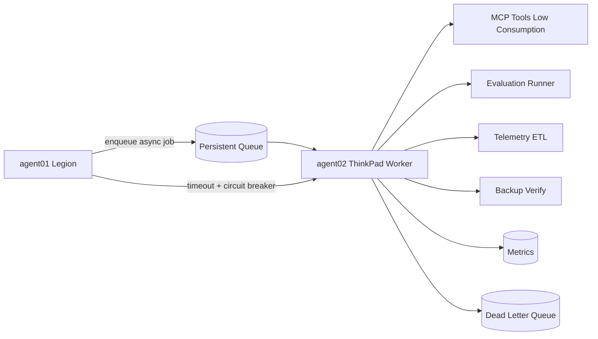
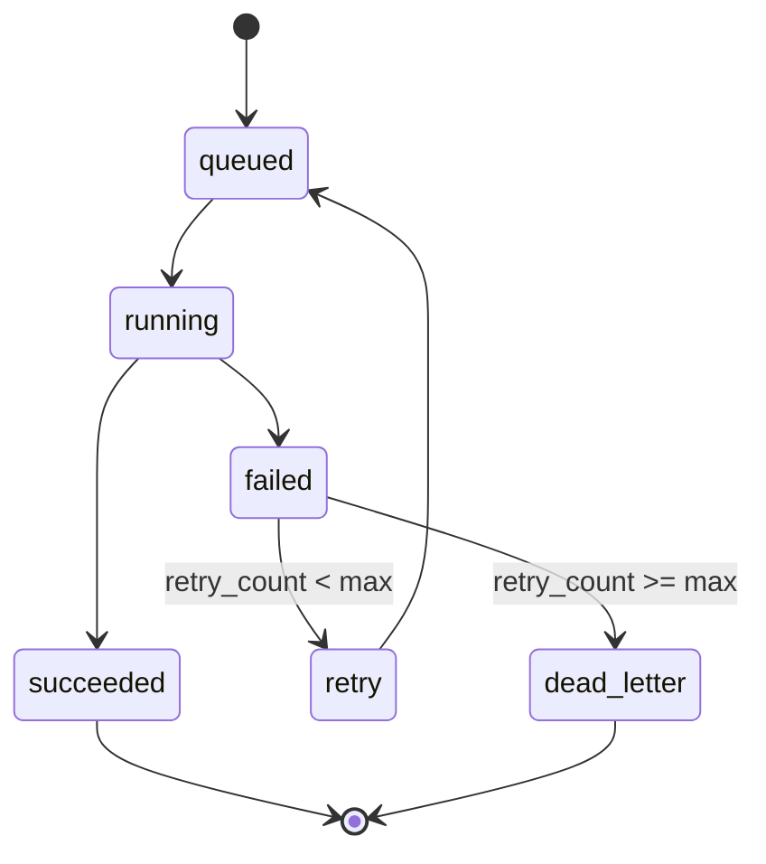
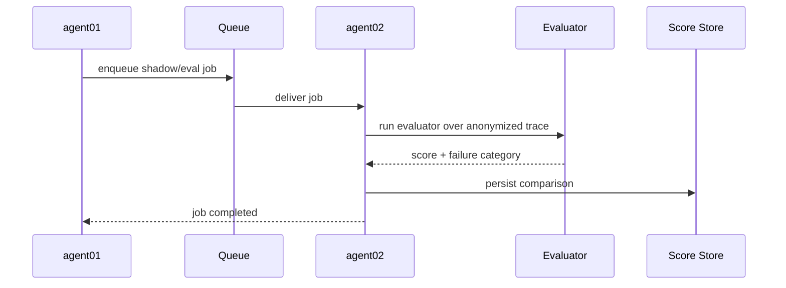

# SPEC 05 - agent02 ThinkPad Worker / Challenger

**Estado:** Draft SDD
**Version:** 0.1
**Fecha:** 2026-09-24
**Rol:** nodo secundario liviano. Nunca sera dependencia del camino basico de atencion.

---

## 1. Mision

`agent02` ejecuta trabajos de bajo consumo y evaluaciones asincronas para mejorar la calidad del Agent Fabric sin poner en riesgo la atencion principal operada por `agent01`.

---

## 2. Responsabilidades

- Jobs asincronos.
- Procesamiento documental.
- Embeddings pequenos.
- Evaluaciones y regression/shadow tests.
- Health checks y monitoring.
- Backups.
- Tools de bajo consumo.
- ETL de telemetria hacia analitica.

---

## 3. Restricciones

- 8 GB RAM estimados: no asumir LLM 7B.
- GPU no asumida hasta verificar hardware.
- No PostgreSQL primario.
- No webhook WhatsApp primario.
- Minimo conjunto de secrets.
- Su caida no afecta la atencion basica de `agent01`.

---

## 4. Comunicacion

Canales:
- LAN privada.
- API/MCP autenticado.
- Cola persistente para jobs asincronos.

Reglas:
- `agent01` aplica timeout.
- `agent01` aplica circuit breaker.
- `agent02` no recibe trafico sincrono obligatorio.
- Todas las llamadas nodo-a-nodo tienen autenticacion.
- Cada job tiene `job_id`, `trace_id`, `tenant_id` y estado persistente.

---

## 5. Rol Challenger

Sobre traces anonimizados:
1. Re-ejecutar evaluacion.
2. Comparar modelo/prompt/skill candidato.
3. Producir score.
4. Registrar diferencias.
5. Nunca promover cambios automaticamente.

Promocion:
- Solo por pipeline controlado.
- Requiere metricas.
- Requiere revision humana o aprobacion explicita.

---

## 6. Metadata De Evaluacion

Cada evaluacion registra:
- Trace original.
- Evaluator/version.
- Dataset/version.
- Score.
- Failure category.
- Candidate version.
- Latencia.
- Recursos CPU/RAM.
- Resultado comparativo.
- Recomendacion operacional.

---

## 7. Colas Y Jobs

Estados:

```text
queued -> running -> succeeded
queued -> running -> failed -> retry
retry -> running
failed -> dead_letter
```

Tipos iniciales:
- `telemetry_etl`
- `rag_reindex_small`
- `document_extract`
- `embedding_small`
- `eval_regression`
- `shadow_compare`
- `backup_verify`
- `health_probe`

Reglas:
- Jobs idempotentes cuando sea posible.
- Max retries configurables por tipo.
- Dead letter queue para fallos persistentes.
- No procesar PII sin redaccion o permiso explicito.

---

## 8. Recursos Y Seguridad

Recursos:
- Limites de CPU/RAM por worker.
- Concurrencia baja por defecto.
- No cargar modelos grandes sin benchmark.

Secretos:
- Solo secrets requeridos para tools del worker.
- No tokens Meta primarios.
- No credenciales de PostgreSQL primario con permisos de escritura amplia.

Red:
- No exponer puertos publicos.
- API privada autenticada.
- Firewall deny incoming por defecto salvo allowlist.

---

## 9. Observabilidad

Endpoints:
- `/health`: proceso vivo.
- `/ready`: dependencias minimas listas.
- `/metrics`: CPU/RAM/jobs, protegido o solo red privada.

Metricas:
- Jobs queued/running/succeeded/failed.
- Latencia por tipo de job.
- Retry rate.
- Dead letter count.
- CPU/RAM.
- Disk usage.
- Network errors.
- Circuit breaker opens.

---

## 10. Definition Of Done

- `/health` y `/ready`.
- Autenticacion nodo-a-nodo.
- Worker con una cola.
- Una tool MCP pequena.
- Job de evaluacion.
- Metricas CPU/RAM.
- Graceful shutdown.
- Prueba de desconexion sin impacto en `agent01`.

---

## 11. Diagramas Mermaid

### 11.1 Topologia agent02



### 11.2 Estados De Job



### 11.3 Challenger Evaluation


