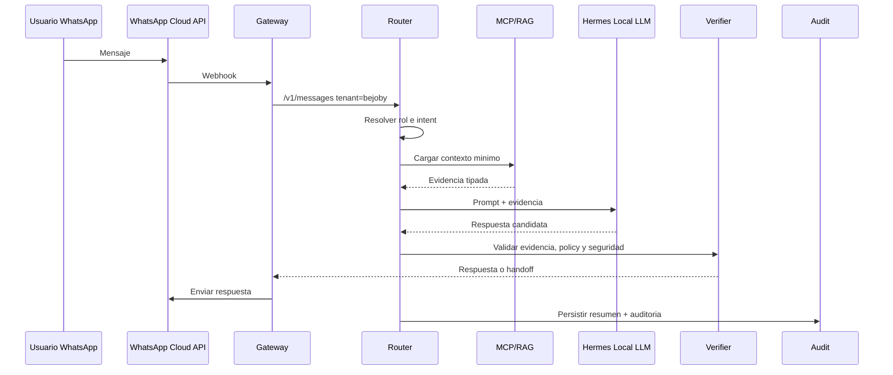
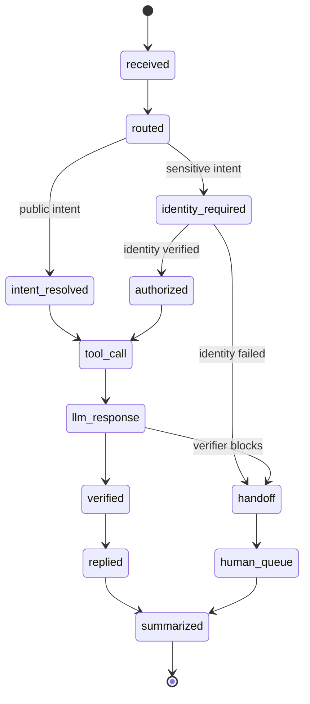

# SPEC 01 - BeJoby Conversational Agent

**Tenant:** `bejoby`
**Prioridad:** P1
**Canales iniciales:** WhatsApp, futuro webchat
**Estado:** Draft SDD
**Fecha:** 2026-09-23

---

## 1. Mision

Atender a candidatos y empleadores de BeJoby, resolver consultas, guiar procesos, recuperar informacion desde BD/RAG y escalar a un humano cuando corresponda.

El agente no debe reemplazar decisiones humanas de contratacion.

---

## 2. Usuarios

### Candidato

Casos:
- Buscar vacantes.
- Consultar requisitos.
- Conocer estado de una postulacion.
- Entregar o actualizar CV cuando el flujo lo permita.
- Entender como funciona BeJoby.
- Solicitar ayuda.
- Consultar privacidad/consentimiento.
- Pedir hablar con una persona.

### Empleador

Casos:
- Conocer servicios.
- Solicitar contacto.
- Entregar requerimiento de perfil.
- Consultar proceso o estado cuando exista autorizacion.
- Agendar conversacion.
- Pedir propuesta.

---

## 3. Intents Iniciales

```yaml
candidate:
  - jobs_search
  - job_details
  - application_status
  - cv_intake
  - profile_update
  - consent_privacy
  - faq
  - human_help

employer:
  - service_info
  - hiring_need
  - lead_capture
  - meeting_request
  - process_status
  - human_help
```

---

## 4. Skills

- `bejoby.intent`
- `bejoby.jobs_search`
- `bejoby.job_details`
- `bejoby.application_status`
- `bejoby.cv_intake`
- `bejoby.profile_read`
- `bejoby.profile_update`
- `bejoby.consent`
- `bejoby.employer_lead`
- `bejoby.appointment`
- `bejoby.handoff`
- shared `faq_rag`
- shared `conversation_summary`

---

## 5. MCP Contract

### Tools

Ejemplos:

```text
jobs.search(filters)
jobs.get(job_id)
candidate.get(external_user_id)
candidate.update(...)
application.get_status(candidate_id, application_id)
lead.create(...)
appointment.request(...)
consent.record(...)
handoff.create(...)
```

### Resources

- FAQs BeJoby.
- Politicas de privacidad/consentimiento vigentes.
- Catalogo de vacantes publicas.
- Guias de candidatos.
- Guias de empleadores.

### Reglas

- Consultas SQL directas desde el LLM: prohibidas.
- Exponer vistas/tools con esquema tipado.
- Toda consulta debe filtrar por tenant.
- Estado de postulacion solo despues de resolver identidad/autorizacion.

---

## 6. RAG

Namespaces:

```text
bejoby/public
bejoby/candidate-help
bejoby/employer-help
bejoby/legal
```

No mezclar:
- CV privados.
- Conversaciones de otros usuarios.
- Informacion interna no autorizada.

con RAG publico.

---

## 7. Flujo Principal

```text
WhatsApp message
    ↓
Gateway
    ↓
Router -> tenant=bejoby
    ↓
Resolve role (candidate/employer/unknown)
    ↓
Intent
    ↓
Load minimum context
    ↓
RAG and/or MCP tool
    ↓
LLM
    ↓
Verifier
    ↓
Reply / Handoff
    ↓
Persist summary + audit
```

---

## 8. Identidad Y Consentimiento

Antes de exponer:
- Estado de una postulacion.
- CV.
- Datos personales.
- Historial sensible.

ejecutar skill de identidad/autorizacion.

Registrar:
- Finalidad.
- Fecha.
- Canal.
- Version del texto de consentimiento.
- Acciones derivadas.

No pedir informacion innecesaria por WhatsApp.

---

## 9. Handoff Humano

Escalar cuando:
- Usuario lo pide.
- Identidad no puede verificarse.
- Dato no esta disponible.
- Reclamo/conflicto.
- Peticion legal.
- Cambio irreversible.
- Respuesta requiere juicio de seleccion humano.
- Loop excede budget.

Crear ticket/registro con:
- Resumen.
- Intent.
- Ultimos mensajes relevantes.
- Tool results.
- Motivo de handoff.

---

## 10. Integracion Desde BeJoby.com

Variables:

```text
AGENT_PLATFORM_URL
AGENT_SERVICE_TOKEN
BEJOBY_TENANT=bejoby
```

Request al contrato comun `/v1/messages`.

El frontend nunca debe recibir:
- Tokens de Meta.
- Credenciales DB.
- Credenciales MCP internas.

---

## 11. Loop Engineering

Maximo inicial sugerido:
- 4 iteraciones tool/LLM por mensaje sincrono.
- Timeout total configurable.
- Una sola pregunta de aclaracion antes de handoff si la intencion sigue ambigua.

Verifier:
- Respuesta basada en fuentes/tools.
- No inventar vacantes.
- No inventar estados.
- Confirmar que job/application IDs existen.
- No decidir "contratar/no contratar".

---

## 12. Metricas

- Conversaciones candidato/empleador.
- Intents.
- Resolucion sin humano.
- Handoff rate.
- Latencia p50/p95.
- Consultas sin evidencia.
- Tool failures.
- Candidatos que pasan de consulta a accion.
- Leads de empleadores.

---

## 13. Definition Of Done

- Router reconoce `bejoby`.
- Candidato vs empleador.
- Jobs search real.
- Estado de postulacion con autorizacion.
- RAG de FAQ.
- Lead de empleador.
- Handoff.
- Auditoria.
- Test end-to-end WhatsApp.
- Tests de aislamiento entre tenants.

---

## 14. Arquitectura Objetivo

```mermaid
flowchart LR
  WA[WhatsApp User] --> META[Meta WhatsApp Cloud API]
  META --> GW[Gateway / Webhook]
  WEB[BeJoby Webchat Future] --> GW
  GW --> Router[Conversation Router]
  Router --> Tenant[Tenant Resolver: bejoby]
  Tenant --> Role[Role Resolver]
  Role --> Intent[Intent Classifier]
  Intent --> Ctx[Minimum Context Loader]
  Ctx --> RAG[RAG Namespaces]
  Ctx --> MCP[MCP Tools]
  RAG --> LLM[Hermes / Local LLM]
  MCP --> LLM
  LLM --> Verifier[Verifier]
  Verifier --> Reply[Reply]
  Verifier --> Handoff[Human Handoff]
  Reply --> Audit[(Conversation Summary + Audit)]
  Handoff --> Audit
```



---

## 15. Lenovo GPU Agent Host

El Lenovo Legion sera tratado como host privado de inferencia y ejecucion de agente.

Objetivo permanente:

```text
SSD Lenovo
  -> Ubuntu instalado permanentemente
  -> hostname: aif369-gpu01
  -> usuario: erwin
  -> SSH con llave
  -> NVIDIA drivers
  -> Docker
  -> NVIDIA Container Toolkit
  -> Hermes/local LLM
  -> Agent service
  -> WhatsApp Gateway integration
```

Reglas:
- No instalar servicios definitivos sobre Ubuntu Live USB.
- Primero instalar Ubuntu en SSD.
- No abrir SSH a internet.
- Acceso remoto externo solo con VPN privada o tunnel aprobado.
- API local del modelo no debe quedar expuesta publicamente.
- El agente debe ejecutarse como usuario no-root.
- Servicios deben correr con `systemd` o contenedores con restart policy.
- Logs no deben guardar CVs completos ni PII innecesaria.

---

## 16. Seguridad Operacional

SSH:
- Password login deshabilitado despues de instalar llaves.
- Root login deshabilitado.
- `ufw` deny incoming por defecto.
- Permitir SSH solo desde red administrada o VPN.

Secretos:
- Tokens Meta, DB, MCP y `AGENT_SERVICE_TOKEN` en `.env` protegido o secret manager.
- Nunca exponer secretos al frontend.
- Rotacion documentada.

Datos:
- RAG publico separado de datos privados.
- Conversaciones resumidas con minimizacion de PII.
- Tool calls auditables.
- Retencion configurable por tipo de conversacion.

IA:
- Modelos locales pueden responder, pero decisiones sensibles requieren verifier y/o humano.
- No usar CV raw completo como contexto salvo consentimiento y necesidad justificada.
- Handoff obligatorio para reclamos, legales, identidad no resuelta y seleccion humana.

---

## 17. Diagramas Mermaid

### 17.1 Secuencia De Mensaje



### 17.2 Maquina De Estados



### 17.3 Limites De Confianza

```mermaid
flowchart TB
  subgraph Public[Public Channel]
    WA[WhatsApp]
    Web[Future Webchat]
  end

  subgraph Edge[Edge/API Boundary]
    Gateway[Gateway]
    Contract[/v1/messages]
  end

  subgraph Private[Private Agent Boundary]
    Router[Router]
    Verifier[Verifier]
    MCP[MCP Tools]
    RAG[RAG]
    LLM[Local Hermes]
  end

  subgraph Data[Data Boundary]
    PublicRAG[(Public RAG)]
    PrivateDB[(BeJoby DB)]
    Audit[(Audit Logs)]
  end

  WA --> Gateway
  Web --> Gateway
  Gateway --> Contract
  Contract --> Router
  Router --> MCP
  Router --> RAG
  Router --> LLM
  LLM --> Verifier
  MCP --> PrivateDB
  RAG --> PublicRAG
  Router --> Audit
```

