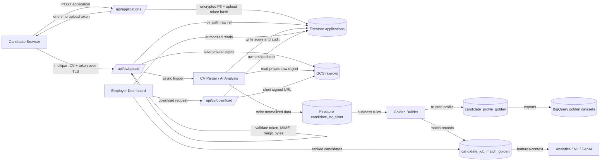
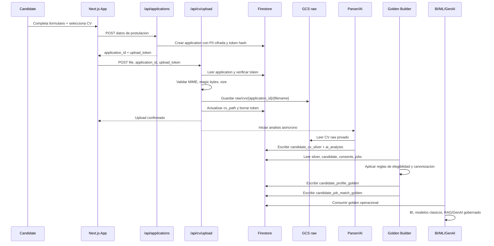
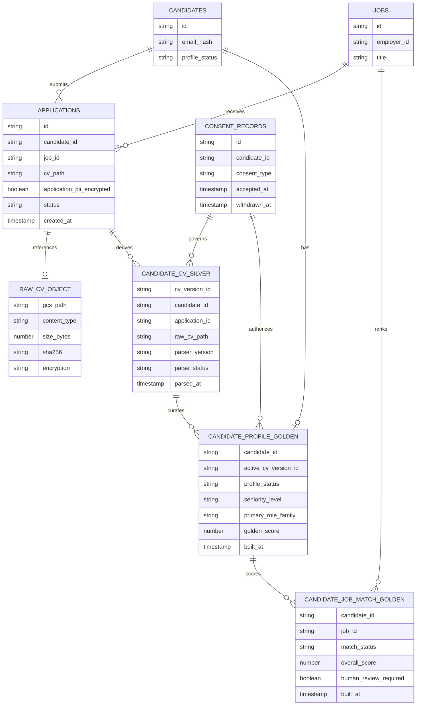
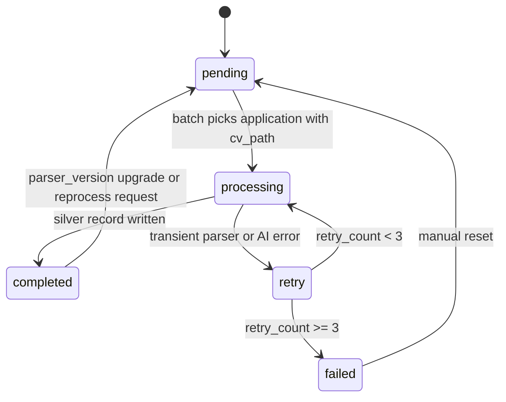
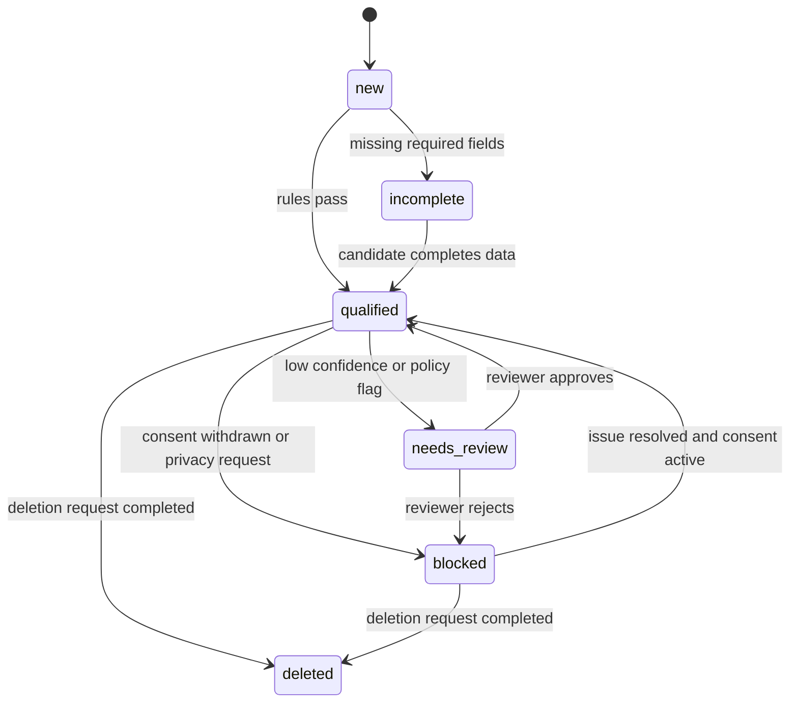
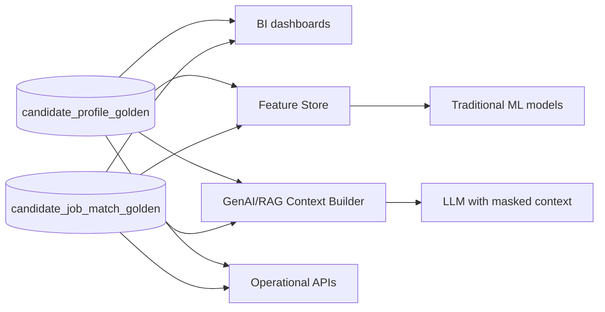
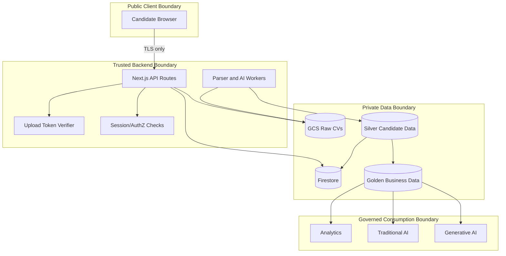

# BeJoby - SDD: CV Raw-Silver-Golden Data Pipeline

**Estado:** Aprobado para implementacion incremental  
**Version:** 0.2
**Fecha:** 2026-09-21
**Metodologia:** Spec Driven Development (SDD)

---

## 1. Objetivo

Cuando un postulante envia su CV, BeJoby debe conservar el archivo original en una zona `raw` de Google Cloud Storage, derivar una vista `silver` con datos parseados y normalizados, y publicar una capa `golden` con entidades confiables de negocio para analitica, IA tradicional e IA generativa.

El archivo original no se modifica. Toda extraccion, scoring o enriquecimiento se escribe como datos derivados y trazables.

---

## 2. Alcance

Incluido:
- Upload obligatorio de CV por postulacion.
- Almacenamiento del binario original en GCS bajo `raw/cvs/{application_id}/{filename}`.
- Cifrado en transito via HTTPS/TLS y cifrado en reposo via Google-managed encryption o CMEK si `GCS_CV_KMS_KEY_NAME` esta configurado.
- Registro en Firestore de la ruta privada `applications.cv_path`.
- Parsing asincrono del CV y generacion de datos `silver`.
- Consolidacion de datos `golden` por candidato, postulacion y match contra vacantes.
- Auditoria minima para reconstruir origen, version, consentimiento y resultado de parsing.

Fuera de alcance inmediato:
- Data warehouse fisico en BigQuery. El diseno lo permite, pero el MVP usa Firestore + GCS.
- Publicacion de URLs permanentes de CVs.
- Edicion manual del CV original.

---

## 3. Definiciones De Datos

### Raw

Zona inmutable del archivo recibido desde el postulante.

GCS:

```text
gs://bejoby-cvs/raw/cvs/{application_id}/{safe_filename}
```

Reglas:
- Objeto privado.
- Sin acceso publico.
- No se sobreescribe si la postulacion ya tiene `cv_path`.
- Validacion de MIME y magic bytes antes de guardar.
- Tamano maximo: 5 MB.
- Se conserva para trazabilidad y reprocesamiento.

### Silver

Zona derivada con datos parseados y normalizados. Silver conserva detalle tecnico y calidad del parsing, pero todavia no es la fuente final de negocio.

Firestore propuesto:

```text
candidate_cv_silver/{cv_version_id}
  candidate_id: string
  application_id: string
  raw_cv_path: string
  raw_cv_sha256: string
  parser_version: string
  parse_status: "pending" | "processing" | "completed" | "failed"
  parsed_at: timestamp | null
  source_filename: string
  source_content_type: string
  extracted_text_ref: string | null
  normalized_profile:
    full_name: string | null
    email_hash: string | null
    phone_hash: string | null
    location: string | null
    linkedin_url: string | null
    seniority: string | null
    english_level: string | null
    expected_monthly_rate: string | null
  skills: array<object>
  experience: array<object>
  education: array<object>
  certifications: array<object>
  quality:
    confidence_score: number
    missing_fields: array<string>
    warnings: array<string>
  governance:
    consent_record_id: string | null
    pii_encrypted: boolean
    human_review_required: boolean
    retention_until: timestamp | null
  created_at: timestamp
  updated_at: timestamp
```

Nota: PII directa debe quedar cifrada o hasheada segun el uso. Los endpoints de empleador deben devolver campos enmascarados salvo descarga autorizada.

### Golden

Zona curada de negocio. Golden consolida candidate, CV parseado, postulaciones, consentimiento, actividad y resultados de matching en tablas/documentos estables para consumo analitico y modelos.

Golden no debe ser una copia del CV. Debe representar entidades de negocio confiables, versionadas y con reglas de elegibilidad.

Firestore operacional propuesto:

```text
candidate_profile_golden/{candidate_id}
  candidate_id: string
  active_cv_version_id: string
  active_application_ids: array<string>
  profile_status: "new" | "qualified" | "incomplete" | "blocked" | "deleted"
  pii_policy: "masked" | "encrypted" | "restricted"
  full_name_encrypted: string | null
  email_hash: string
  phone_hash: string | null
  country: string | null
  city: string | null
  seniority_level: "junior" | "mid" | "senior" | "lead" | "principal" | "executive" | null
  primary_role_family: string | null
  english_level: "A1" | "A2" | "B1" | "B2" | "C1" | "C2" | null
  expected_monthly_rate:
    amount: number | null
    currency: string | null
    period: "monthly"
  availability:
    status: "immediate" | "two_weeks" | "one_month" | "custom" | null
    available_from: timestamp | null
  canonical_skills: array<object>
  years_experience_total: number | null
  education_highest_level: string | null
  certifications: array<object>
  consent:
    profile_processing_active: boolean
    job_application_sharing_active: boolean
    ai_processing_active: boolean
    latest_consent_record_ids: array<string>
  quality:
    golden_score: number
    completeness_score: number
    confidence_score: number
    requires_human_review: boolean
    exclusion_reasons: array<string>
  lineage:
    raw_cv_path: string
    silver_cv_version_id: string
    parser_version: string
    ruleset_version: string
    built_at: timestamp
  created_at: timestamp
  updated_at: timestamp
```

```text
candidate_job_match_golden/{candidate_id}_{job_id}
  candidate_id: string
  job_id: string
  employer_id: string
  application_id: string | null
  match_status: "eligible" | "not_eligible" | "needs_review" | "withdrawn"
  score:
    overall: number
    skills: number
    experience: number
    language: number
    rate_fit: number
    availability: number
  explainability:
    strengths: array<string>
    gaps: array<string>
    summary: string
  governance:
    ai_processing_allowed: boolean
    automated_decision: boolean
    human_review_required: boolean
  lineage:
    candidate_profile_version: string
    job_version: string
    model_version: string
    ruleset_version: string
    built_at: timestamp
```

BigQuery/analytics recomendado para escala:

```text
bejoby_analytics.golden_candidate_profile
bejoby_analytics.golden_candidate_job_match
bejoby_analytics.golden_funnel_events
bejoby_analytics.golden_ai_feature_store
bejoby_analytics.golden_genai_context
```

Firestore sigue siendo la fuente operacional para la app. BigQuery debe ser la capa analitica y feature store cuando el volumen o los casos de BI/modelado lo requieran.

---

## 4. Reglas De Negocio Para Golden

### 4.1 Elegibilidad De Candidato

Un candidato puede pasar a `candidate_profile_golden.profile_status = "qualified"` solo si:
- Existe `candidate_cv_silver.parse_status = "completed"`.
- Existe consentimiento activo para `profile_processing`.
- El candidato no tiene solicitud activa de eliminacion, bloqueo u oposicion.
- `quality.confidence_score >= 0.70`.
- Tiene al menos email hasheado, nombre cifrado o identificador de contacto valido.
- No hay conflicto critico entre datos declarados y CV parseado.

Si falta informacion clave, queda `incomplete`. Si hay baja confianza, inconsistencia material o posible dato sensible no esperado, queda `blocked` o `requires_human_review = true`.

### 4.2 Seleccion De CV Activo

Golden usa un unico `active_cv_version_id` por candidato:
- Prioridad 1: CV de la postulacion mas reciente con parsing exitoso.
- Prioridad 2: CV marcado manualmente como activo por el candidato.
- Prioridad 3: CV con mayor `confidence_score` si hay empate temporal.

El CV raw nunca se usa directamente para analitica o matching, salvo reprocesamiento controlado.

### 4.3 Normalizacion De Skills

Las skills deben pasar por canonizacion:
- Trim, lowercase tecnico y mapping a skill canonica.
- Alias: `gcp` -> `google cloud`, `bq` -> `bigquery`.
- Nivel inferido: `unknown`, `basic`, `intermediate`, `advanced`, `expert`.
- Evidencia: `cv`, `candidate_form`, `assessment`, `manual_review`.

Golden debe guardar skills canonicas, no solo texto libre del CV.

### 4.4 Matching Contra Vacantes

`candidate_job_match_golden` se genera cuando existe una vacante activa o una postulacion:
- Candidato debe estar `qualified` o `needs_review`.
- Job debe estar activo/publicado.
- Debe existir permiso de uso para `ai_processing` si se usan modelos.
- El score debe separar componentes para auditoria: skills, experiencia, idioma, rate y disponibilidad.
- Ninguna decision de rechazo final debe ser 100% automatizada sin revision humana cuando la gobernanza lo indique.

### 4.5 Consumo Por Analitica, IA Tradicional Y GenAI

Analitica:
- Usar tablas/documentos golden agregados y sin PII directa.
- Metricas permitidas: funnel, tiempos de proceso, conversion, demanda de skills, rangos de tarifa.

IA tradicional:
- Usar `golden_ai_feature_store`.
- Features deben ser versionadas, reproducibles y sin datos sensibles innecesarios.
- Labels de entrenamiento deben excluir decisiones sesgadas o sin trazabilidad.

IA generativa:
- Usar `golden_genai_context`.
- Contexto minimo necesario, enmascarado por defecto.
- Nunca pasar CV raw completo a un LLM externo salvo consentimiento explicito, contrato aprobado y anonimizacion previa.
- Prompts deben incluir `candidate_id`, `profile_version`, `job_version`, `model_version` y politica de privacidad aplicada.

---

## 5. Requisitos Funcionales

1. Al enviar una postulacion, la API crea `applications/{application_id}` con PII cifrada y un `cv_upload_token` de un solo uso.
2. El browser sube el CV a `/api/cv/upload` usando `application_id` y `upload_token`.
3. La API valida token, tipo de archivo, firma binaria y tamano.
4. La API guarda el archivo original en GCS raw.
5. La API actualiza `applications.cv_path` con la ruta privada raw.
6. El proceso de parsing analiza el raw CV y escribe un documento `candidate_cv_silver`.
7. El proceso de curacion aplica reglas de negocio y escribe `candidate_profile_golden`.
8. El proceso de matching escribe `candidate_job_match_golden` para vacantes activas o postulaciones.
9. Analitica, IA tradicional y GenAI leen desde golden o exports gobernados, no desde raw.
10. La descarga de CV solo se realiza por endpoint backend con autorizacion y signed URL corta.

---

## 6. Requisitos No Funcionales

| Categoria | Requisito |
|-----------|-----------|
| Seguridad | TLS en transito, objetos privados, bucket sin acceso publico |
| Reposo | Cifrado GCS por defecto o CMEK mediante `GCS_CV_KMS_KEY_NAME` |
| Integridad | Validacion CRC32C en upload y checksum SHA-256 para versionado silver |
| Privacidad | PII cifrada en Firestore; emails/telefonos hasheados para lookup |
| Trazabilidad | Cada silver record referencia `raw_cv_path`, `application_id`, parser y timestamps |
| Idempotencia | Reprocesar el mismo raw no debe duplicar una version activa sin razon |
| Retencion | Raw y silver deben obedecer solicitudes de privacidad y politicas de retencion |
| Contratos Golden | Consumidores externos solo leen schemas versionados y documentados |
| Minimizacion | Golden excluye PII directa salvo campos cifrados estrictamente necesarios |

---

## 7. Diagramas Mermaid

### 7.1 Arquitectura General



### 7.2 Secuencia De Postulacion, Parsing Y Golden



### 7.3 Modelo Raw-Silver-Golden



### 7.4 Estados Del Parsing



### 7.5 Estados De Golden Profile



### 7.6 Consumo Golden



### 7.7 Limites De Confianza



---

## 8. Criterios De Aceptacion

- [x] Los nuevos uploads se guardan con prefijo `raw/cvs/`.
- [x] El endpoint de descarga acepta `raw/cvs/` y mantiene compatibilidad con `cvs/` historico.
- [x] El CV original no queda publico.
- [x] El token de upload se borra despues de un upload exitoso.
- [ ] Crear `candidate_cv_silver` en el parser batch.
- [ ] Crear `candidate_profile_golden` con reglas de elegibilidad y canonizacion.
- [ ] Crear `candidate_job_match_golden` para vacantes activas/postulaciones.
- [ ] Guardar `raw_cv_sha256` al subir o parsear.
- [ ] Definir export BigQuery para datasets golden.
- [ ] Agregar pruebas para path raw y compatibilidad legacy.
- [ ] Definir job programado para reprocesar `pending/retry`.

---

## 9. Tareas Tecnicas

1. Cambiar uploads nuevos a `raw/cvs/{application_id}/{filename}`.
2. Mantener compatibilidad de descarga para `cvs/` legado.
3. Extender `uploadCV()` para devolver `sha256`.
4. Crear helper `upsertCandidateCvSilver()`.
5. Actualizar `processPendingApplications()` para escribir estado silver.
6. Crear helper `buildCandidateProfileGolden()` con reglas versionadas.
7. Crear helper `buildCandidateJobMatchGolden()` con score explicable.
8. Agregar tests unitarios de path raw, validacion de archivo, token y reglas golden.
9. Agregar indices Firestore necesarios para `candidate_cv_silver` por `candidate_id`, `application_id`, `parse_status` y `created_at`.
10. Agregar indices Firestore para `candidate_profile_golden.profile_status`, `candidate_job_match_golden.job_id + score.overall` y `candidate_job_match_golden.match_status`.
11. Definir export programado a BigQuery para datasets golden.
12. Documentar politica de retencion raw/silver/golden en la spec de privacidad.
