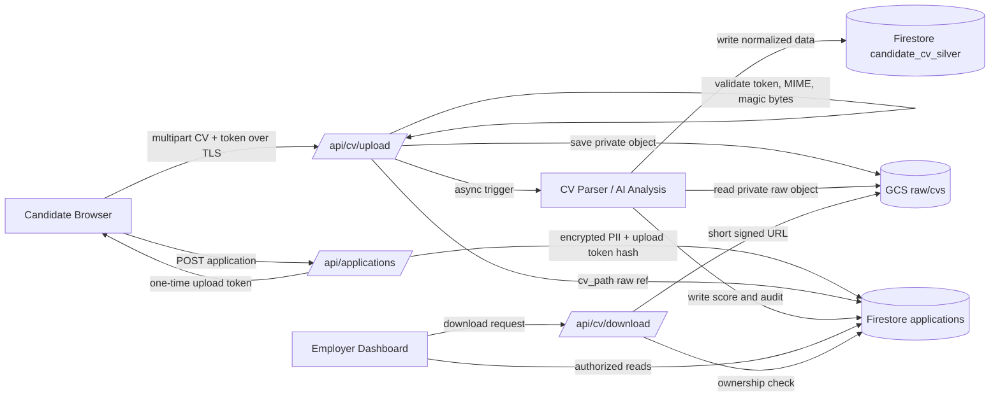
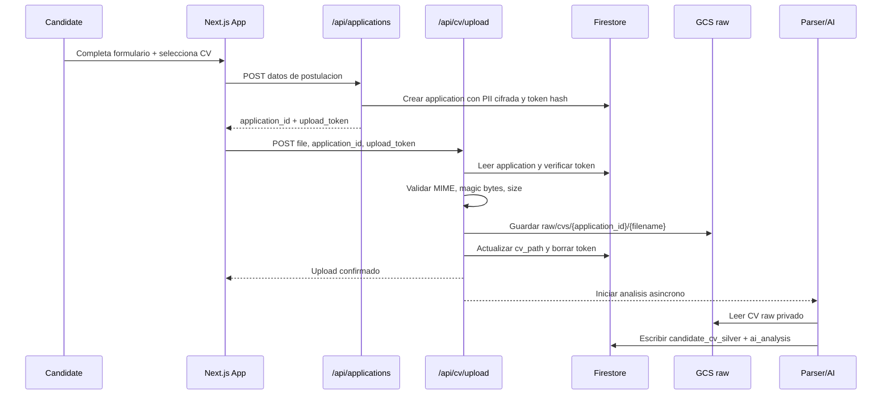
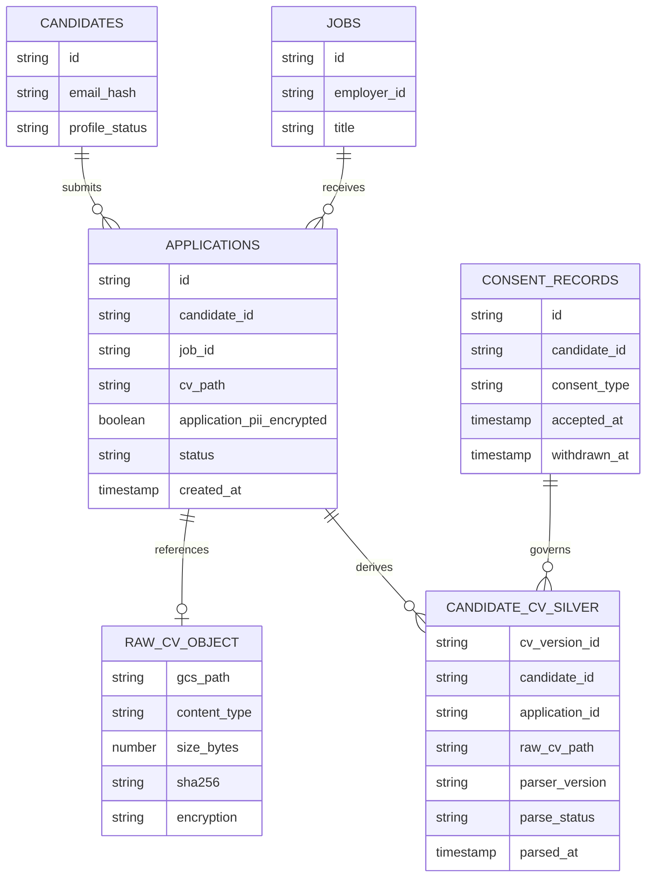
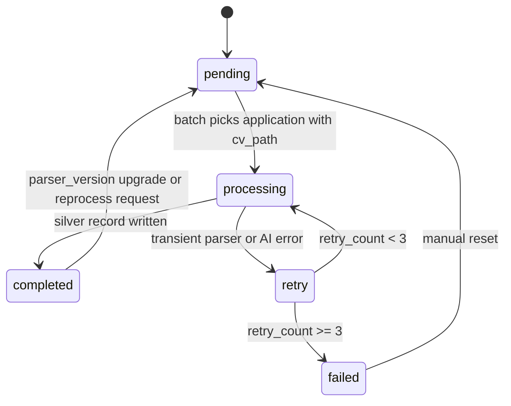
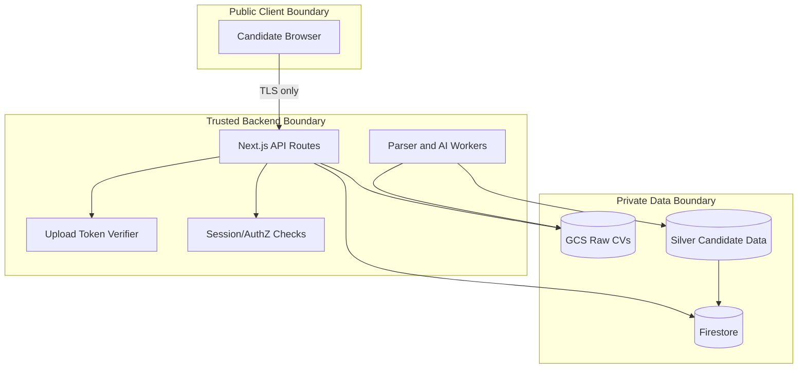

# BeJoby - SDD: CV Raw-to-Silver Data Pipeline

**Estado:** Aprobado para implementacion incremental  
**Version:** 0.1  
**Fecha:** 2026-09-21  
**Metodologia:** Spec Driven Development (SDD)  

---

## 1. Objetivo

Cuando un postulante envia su CV, BeJoby debe conservar el archivo original en una zona `raw` de Google Cloud Storage y derivar una vista `silver` con datos parseados, normalizados y gobernados para la base de datos de candidatos.

El archivo original no se modifica. Toda extraccion, scoring o enriquecimiento se escribe como datos derivados y trazables.

---

## 2. Alcance

Incluido:
- Upload obligatorio de CV por postulacion.
- Almacenamiento del binario original en GCS bajo `raw/cvs/{application_id}/{filename}`.
- Cifrado en transito via HTTPS/TLS y cifrado en reposo via Google-managed encryption o CMEK si `GCS_CV_KMS_KEY_NAME` esta configurado.
- Registro en Firestore de la ruta privada `applications.cv_path`.
- Parsing asincrono del CV y generacion de datos `silver`.
- Auditoria minima para reconstruir origen, version, consentimiento y resultado de parsing.

Fuera de alcance inmediato:
- Data warehouse fisico en BigQuery. El diseno lo permite, pero el MVP usa Firestore + GCS.
- Publicacion de URLs permanentes de CVs.
- Edicion manual del CV original.

---

## 3. Definiciones De Datos

### Raw

Zona inmutable del archivo recibido desde el postulante.

GCS:

```text
gs://bejoby-cvs/raw/cvs/{application_id}/{safe_filename}
```

Reglas:
- Objeto privado.
- Sin acceso publico.
- No se sobreescribe si la postulacion ya tiene `cv_path`.
- Validacion de MIME y magic bytes antes de guardar.
- Tamano maximo: 5 MB.
- Se conserva para trazabilidad y reprocesamiento.

### Silver

Zona derivada con datos parseados, normalizados y listos para busqueda, matching, analitica y operaciones de candidatos.

Firestore propuesto:

```text
candidate_cv_silver/{cv_version_id}
  candidate_id: string
  application_id: string
  raw_cv_path: string
  raw_cv_sha256: string
  parser_version: string
  parse_status: "pending" | "processing" | "completed" | "failed"
  parsed_at: timestamp | null
  source_filename: string
  source_content_type: string
  extracted_text_ref: string | null
  normalized_profile:
    full_name: string | null
    email_hash: string | null
    phone_hash: string | null
    location: string | null
    linkedin_url: string | null
    seniority: string | null
    english_level: string | null
    expected_monthly_rate: string | null
  skills: array<object>
  experience: array<object>
  education: array<object>
  certifications: array<object>
  quality:
    confidence_score: number
    missing_fields: array<string>
    warnings: array<string>
  governance:
    consent_record_id: string | null
    pii_encrypted: boolean
    human_review_required: boolean
    retention_until: timestamp | null
  created_at: timestamp
  updated_at: timestamp
```

Nota: PII directa debe quedar cifrada o hasheada segun el uso. Los endpoints de empleador deben devolver campos enmascarados salvo descarga autorizada.

---

## 4. Requisitos Funcionales

1. Al enviar una postulacion, la API crea `applications/{application_id}` con PII cifrada y un `cv_upload_token` de un solo uso.
2. El browser sube el CV a `/api/cv/upload` usando `application_id` y `upload_token`.
3. La API valida token, tipo de archivo, firma binaria y tamano.
4. La API guarda el archivo original en GCS raw.
5. La API actualiza `applications.cv_path` con la ruta privada raw.
6. El proceso de parsing analiza el raw CV y escribe un documento `candidate_cv_silver`.
7. El matching de IA, dashboards y busquedas leen desde `candidate_cv_silver` o desde `applications.ai_analysis`, no desde el archivo raw directamente.
8. La descarga de CV solo se realiza por endpoint backend con autorizacion y signed URL corta.

---

## 5. Requisitos No Funcionales

| Categoria | Requisito |
|-----------|-----------|
| Seguridad | TLS en transito, objetos privados, bucket sin acceso publico |
| Reposo | Cifrado GCS por defecto o CMEK mediante `GCS_CV_KMS_KEY_NAME` |
| Integridad | Validacion CRC32C en upload y checksum SHA-256 para versionado silver |
| Privacidad | PII cifrada en Firestore; emails/telefonos hasheados para lookup |
| Trazabilidad | Cada silver record referencia `raw_cv_path`, `application_id`, parser y timestamps |
| Idempotencia | Reprocesar el mismo raw no debe duplicar una version activa sin razon |
| Retencion | Raw y silver deben obedecer solicitudes de privacidad y politicas de retencion |

---

## 6. Diagramas Mermaid

### 6.1 Arquitectura General



### 6.2 Secuencia De Postulacion Y Upload



### 6.3 Modelo Raw-Silver



### 6.4 Estados Del Parsing



### 6.5 Limites De Confianza



---

## 7. Criterios De Aceptacion

- [x] Los nuevos uploads se guardan con prefijo `raw/cvs/`.
- [x] El endpoint de descarga acepta `raw/cvs/` y mantiene compatibilidad con `cvs/` historico.
- [x] El CV original no queda publico.
- [x] El token de upload se borra despues de un upload exitoso.
- [ ] Crear `candidate_cv_silver` en el parser batch.
- [ ] Guardar `raw_cv_sha256` al subir o parsear.
- [ ] Agregar pruebas para path raw y compatibilidad legacy.
- [ ] Definir job programado para reprocesar `pending/retry`.

---

## 8. Tareas Tecnicas

1. Cambiar uploads nuevos a `raw/cvs/{application_id}/{filename}`.
2. Mantener compatibilidad de descarga para `cvs/` legado.
3. Extender `uploadCV()` para devolver `sha256`.
4. Crear helper `upsertCandidateCvSilver()`.
5. Actualizar `processPendingApplications()` para escribir estado silver.
6. Agregar tests unitarios de path raw, validacion de archivo y token.
7. Agregar indices Firestore necesarios para `candidate_cv_silver` por `candidate_id`, `application_id`, `parse_status` y `created_at`.
8. Documentar politica de retencion raw/silver en la spec de privacidad.

