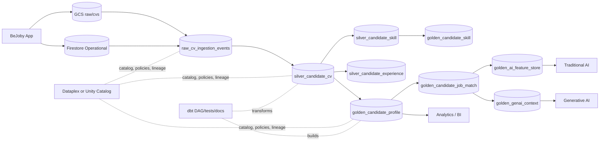

# BeJoby - Data Model: Raw, Silver and Golden Layers

**Estado:** Draft aprobado para arquitectura
**Version:** 0.1
**Fecha:** 2026-09-23
**Metodologia:** Spec Driven Development (SDD)

---

## 1. Proposito

Este documento define el modelo de datos de BeJoby para CVs, candidatos, postulaciones, matching e IA usando arquitectura medallion:

```text
raw -> silver -> golden -> analytics / traditional AI / generative AI
```

El objetivo es separar claramente:
- Archivos originales y eventos de ingestion.
- Datos parseados y normalizados.
- Entidades confiables de negocio.
- Contratos gobernados para BI, modelos tradicionales y GenAI.

---

## 2. Ubicacion Del Modelo

La especificacion inicial vive en:

```text
cv-data-pipeline-sdd.md
```

Este documento complementa esa spec con el modelo de base de datos completo por capa.

---

## 3. Plataformas Recomendadas

### MVP actual

| Capa | Tecnologia | Uso |
|------|------------|-----|
| Raw | Google Cloud Storage | CV original privado |
| Operacional | Firestore | App, postulaciones, tokens, perfiles |
| Silver | Firestore | CV parseado y normalizado |
| Golden | Firestore | Perfil curado y match operacional |
| Analytics futuro | BigQuery | BI, reporting, feature store |

### Lakehouse recomendado

| Capa | Databricks | GCP / BigQuery | dbt |
|------|------------|----------------|-----|
| Raw/Bronze | Delta tables sobre GCS | GCS + external/native tables | sources |
| Silver | Delta tables limpias | BigQuery silver dataset | staging/intermediate models |
| Golden | Delta tables de negocio | BigQuery golden dataset | marts + semantic layer |
| Governance | Unity Catalog | Dataplex/Knowledge Catalog | docs, tests, exposures |
| Lineage | Unity Catalog lineage | Data Lineage API / Dataplex | dbt DAG + artifacts |

Si BeJoby mantiene el stack GCP, el camino natural es GCS + BigQuery + Dataplex/Knowledge Catalog + dbt. Si necesita lakehouse multi-cloud, notebooks Spark, Delta Lake y ML pipelines mas pesados, Databricks encaja muy bien.

---

## 4. Raw Layer

### 4.1 Objetivo

Guardar el dato original, inmutable y auditable. Raw no sirve para consumo directo de analitica ni IA, salvo reprocesamiento controlado.

### 4.2 Storage

```text
gs://bejoby-cvs/raw/cvs/{application_id}/{safe_filename}
```

### 4.3 Metadata Operacional

Firestore:

```text
applications/{application_id}
  id: string
  candidate_id: string
  job_id: string
  employer_id: string
  status: string
  cv_path: string
  cv_filename: string
  cv_content_type: string | null
  cv_size_bytes: number | null
  cv_sha256: string | null
  cv_uploaded_at: timestamp
  application_pii_encrypted: boolean
  batch_processing_status: "pending" | "processing" | "completed" | "retry" | "failed"
  created_at: timestamp
  updated_at: timestamp
```

### 4.4 Tabla Lakehouse / Warehouse Recomendada

BigQuery o Databricks:

```text
raw_cv_ingestion_events
  ingestion_event_id string
  application_id string
  candidate_id string
  raw_cv_path string
  source_filename string
  content_type string
  size_bytes integer
  sha256 string
  upload_status string
  upload_token_validated boolean
  encryption_mode string
  ingested_at timestamp
  ingestion_date date
```

### 4.5 Reglas

- Raw es append-only en lo posible.
- No se publican URLs permanentes.
- Solo backend puede generar signed URLs cortas.
- Raw no debe alimentar dashboards ni modelos directamente.
- Si el candidato solicita eliminacion, raw debe borrarse o quedar bloqueado segun politica legal aplicable.

---

## 5. Silver Layer

### 5.1 Objetivo

Convertir el CV y datos declarados en estructuras normalizadas, con calidad medible y lineage.

### 5.2 Firestore Operacional

```text
candidate_cv_silver/{cv_version_id}
  cv_version_id: string
  candidate_id: string
  application_id: string
  raw_cv_path: string
  raw_cv_sha256: string
  parser_version: string
  parse_status: "pending" | "processing" | "completed" | "failed"
  parsed_at: timestamp | null
  source_filename: string
  source_content_type: string
  extracted_text_ref: string | null
  normalized_profile:
    full_name: string | null
    email_hash: string | null
    phone_hash: string | null
    location: string | null
    linkedin_url: string | null
    seniority: string | null
    english_level: string | null
    expected_monthly_rate: string | null
  skills: array<object>
  experience: array<object>
  education: array<object>
  certifications: array<object>
  quality:
    confidence_score: number
    missing_fields: array<string>
    warnings: array<string>
  governance:
    consent_record_id: string | null
    pii_encrypted: boolean
    human_review_required: boolean
    retention_until: timestamp | null
  created_at: timestamp
  updated_at: timestamp
```

### 5.3 Tablas Silver Recomendadas

```text
silver_candidate_cv
  cv_version_id string
  candidate_id string
  application_id string
  raw_cv_path string
  raw_cv_sha256 string
  parser_version string
  parse_status string
  parsed_at timestamp
  confidence_score numeric
  human_review_required boolean
  created_at timestamp
  updated_at timestamp
```

```text
silver_candidate_profile_extracted
  cv_version_id string
  candidate_id string
  full_name_encrypted string
  email_hash string
  phone_hash string
  linkedin_url string
  location_raw string
  english_level_raw string
  expected_monthly_rate_raw string
```

```text
silver_candidate_skill
  cv_version_id string
  candidate_id string
  skill_raw string
  skill_normalized string
  skill_confidence numeric
  evidence_source string
```

```text
silver_candidate_experience
  cv_version_id string
  candidate_id string
  company_name string
  role_title string
  start_date date
  end_date date
  duration_months integer
  description_summary string
```

### 5.4 Reglas

- Silver puede contener detalle tecnico, pero debe minimizar PII directa.
- Cada registro silver debe referenciar `raw_cv_path` y `parser_version`.
- Las extracciones deben ser reproducibles por version de parser.
- Si `confidence_score < 0.70`, golden no puede calificar automaticamente al candidato.

---

## 6. Golden Layer

### 6.1 Objetivo

Publicar entidades de negocio confiables, listas para consumo por app, BI, IA tradicional y GenAI. Golden representa decisiones y reglas de BeJoby, no solo parsing.

### 6.2 Firestore Operacional

```text
candidate_profile_golden/{candidate_id}
  candidate_id: string
  active_cv_version_id: string
  active_application_ids: array<string>
  profile_status: "new" | "qualified" | "incomplete" | "blocked" | "deleted"
  pii_policy: "masked" | "encrypted" | "restricted"
  full_name_encrypted: string | null
  email_hash: string
  phone_hash: string | null
  country: string | null
  city: string | null
  seniority_level: "junior" | "mid" | "senior" | "lead" | "principal" | "executive" | null
  primary_role_family: string | null
  english_level: "A1" | "A2" | "B1" | "B2" | "C1" | "C2" | null
  expected_monthly_rate:
    amount: number | null
    currency: string | null
    period: "monthly"
  availability:
    status: "immediate" | "two_weeks" | "one_month" | "custom" | null
    available_from: timestamp | null
  canonical_skills: array<object>
  years_experience_total: number | null
  education_highest_level: string | null
  certifications: array<object>
  consent:
    profile_processing_active: boolean
    job_application_sharing_active: boolean
    ai_processing_active: boolean
    latest_consent_record_ids: array<string>
  quality:
    golden_score: number
    completeness_score: number
    confidence_score: number
    requires_human_review: boolean
    exclusion_reasons: array<string>
  lineage:
    raw_cv_path: string
    silver_cv_version_id: string
    parser_version: string
    ruleset_version: string
    built_at: timestamp
  created_at: timestamp
  updated_at: timestamp
```

```text
candidate_job_match_golden/{candidate_id}_{job_id}
  candidate_id: string
  job_id: string
  employer_id: string
  application_id: string | null
  match_status: "eligible" | "not_eligible" | "needs_review" | "withdrawn"
  score:
    overall: number
    skills: number
    experience: number
    language: number
    rate_fit: number
    availability: number
  explainability:
    strengths: array<string>
    gaps: array<string>
    summary: string
  governance:
    ai_processing_allowed: boolean
    automated_decision: boolean
    human_review_required: boolean
  lineage:
    candidate_profile_version: string
    job_version: string
    model_version: string
    ruleset_version: string
    built_at: timestamp
```

### 6.3 Tablas Golden Recomendadas

```text
golden_candidate_profile
  candidate_id string
  active_cv_version_id string
  profile_status string
  email_hash string
  country string
  city string
  seniority_level string
  primary_role_family string
  english_level string
  expected_monthly_rate_amount numeric
  expected_monthly_rate_currency string
  availability_status string
  years_experience_total numeric
  education_highest_level string
  golden_score numeric
  completeness_score numeric
  confidence_score numeric
  requires_human_review boolean
  profile_processing_active boolean
  ai_processing_active boolean
  ruleset_version string
  built_at timestamp
```

```text
golden_candidate_skill
  candidate_id string
  active_cv_version_id string
  skill_id string
  skill_name string
  skill_family string
  proficiency_level string
  evidence_source string
  confidence_score numeric
```

```text
golden_candidate_job_match
  candidate_id string
  job_id string
  employer_id string
  application_id string
  match_status string
  overall_score numeric
  skills_score numeric
  experience_score numeric
  language_score numeric
  rate_fit_score numeric
  availability_score numeric
  human_review_required boolean
  model_version string
  ruleset_version string
  built_at timestamp
```

```text
golden_funnel_events
  event_id string
  candidate_id string
  application_id string
  job_id string
  employer_id string
  event_type string
  event_timestamp timestamp
  event_date date
  source_system string
```

```text
golden_ai_feature_store
  entity_id string
  entity_type string
  feature_set_version string
  features_json json
  label_json json
  valid_from timestamp
  valid_to timestamp
  created_at timestamp
```

```text
golden_genai_context
  context_id string
  candidate_id string
  job_id string | null
  context_type string
  masked_context string
  source_profile_version string
  source_match_version string | null
  pii_policy string
  consent_snapshot_id string
  model_policy_version string
  created_at timestamp
```

### 6.4 Reglas De Negocio Golden

Un candidato queda `qualified` solo si:
- Tiene silver CV con `parse_status = "completed"`.
- Tiene consentimiento vigente para `profile_processing`.
- No tiene solicitud activa de eliminacion, bloqueo u oposicion.
- `confidence_score >= 0.70`.
- Tiene contacto minimo confiable: email hash y/o telefono hash.
- No hay conflicto critico entre datos declarados y CV parseado.

Reglas de CV activo:
- Usar el CV parseado mas reciente asociado a una postulacion exitosa.
- Si el candidato marca un CV activo, respetarlo.
- Si hay empate, elegir mayor `confidence_score`.

Reglas de skills:
- Guardar skill canonica, familia, nivel y evidencia.
- No usar solo texto libre del CV como atributo golden.
- Versionar diccionario de skills.

Reglas de IA:
- IA tradicional usa `golden_ai_feature_store`.
- GenAI usa `golden_genai_context`, no raw CV.
- Todo contexto GenAI debe estar minimizado, enmascarado y trazado.
- Rechazos o decisiones de alto impacto requieren revision humana si la politica lo exige.

---

## 7. dbt

dbt puede encargarse de las transformaciones `silver -> golden` y de los contratos de calidad.

Estructura sugerida:

```text
dbt/
  models/
    sources/
      sources.yml
    staging/
      stg_applications.sql
      stg_candidate_cv_silver.sql
      stg_jobs.sql
      stg_consents.sql
    intermediate/
      int_candidate_active_cv.sql
      int_candidate_skill_canonicalized.sql
      int_candidate_quality_score.sql
      int_candidate_job_score_components.sql
    marts/
      golden_candidate_profile.sql
      golden_candidate_skill.sql
      golden_candidate_job_match.sql
      golden_funnel_events.sql
      golden_ai_feature_store.sql
      golden_genai_context.sql
  tests/
  macros/
  exposures.yml
```

Tests minimos:
- `candidate_id` no nulo en golden.
- `email_hash` unico por candidato activo cuando aplique.
- `overall_score` entre 0 y 100.
- `profile_status` en enum permitido.
- No PII directa en tablas de BI.
- Freshness de sources raw/silver.

---

## 8. Databricks

Si se usa Databricks, el diseno calza con medallion architecture:

```text
bronze/raw   = CV ingestion events + referencias a objetos raw
silver       = parsed CV, normalized skills, normalized experience
gold/golden  = business-ready candidate profile, job match, AI feature/context tables
```

Implementacion sugerida:
- GCS como storage.
- Delta Lake para tablas bronze/silver/gold.
- Unity Catalog para permisos, catalogo, linaje y data products.
- Workflows o Delta Live Tables para pipelines.
- MLflow/Feature Engineering para modelos tradicionales.
- Vector Search o tabla golden_genai_context para GenAI/RAG.

---

## 9. Gobernanza Y Linaje

### GCP

Usar Dataplex Universal Catalog / Knowledge Catalog para:
- Catalogar assets de GCS, BigQuery y Vertex AI.
- Definir metadata, owners, dominios y clasificaciones.
- Consultar linaje con Data Lineage.
- Aplicar politicas por dominio y sensibilidad.

### Databricks

Usar Unity Catalog para:
- Catalogos por ambiente: `dev`, `qa`, `prod`.
- Schemas por capa: `raw`, `silver`, `gold`.
- Permisos por rol.
- Lineage de tablas, notebooks, jobs y dashboards.
- Data classification tags.

### dbt

Usar dbt para:
- DAG de transformaciones.
- Documentacion de modelos y columnas.
- Tests de calidad.
- Exposures para BI, dashboards, APIs y modelos.
- Semantic layer para metricas consistentes.

---

## 10. Diagrama General



---

## 11. Recomendacion De Implementacion

Para BeJoby hoy:

1. Mantener Firestore + GCS para el flujo operacional.
2. Crear documentos `candidate_cv_silver`, `candidate_profile_golden` y `candidate_job_match_golden`.
3. Exportar a BigQuery para analitica y modelos.
4. Usar dbt sobre BigQuery para transformar silver/golden y documentar reglas.
5. Usar Dataplex/Knowledge Catalog para gobierno y linaje en GCP.
6. Evaluar Databricks cuando se necesite lakehouse avanzado, Delta, Spark, MLflow o multi-cloud.
