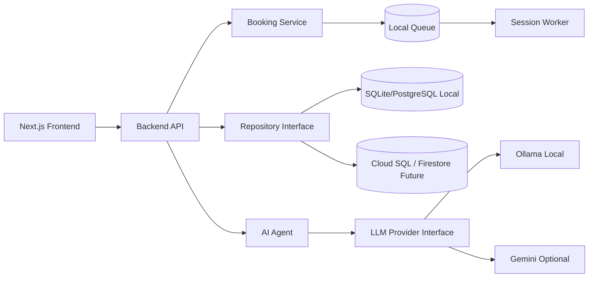
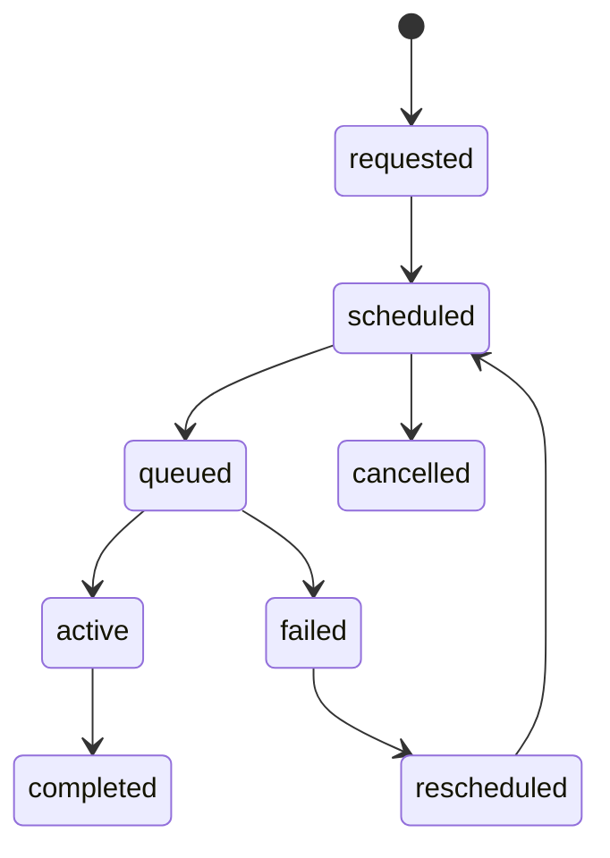
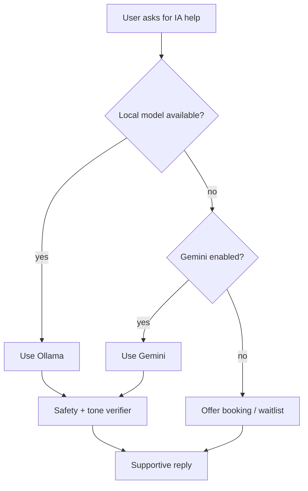

# SPEC-001 - BeJoby Local PoC Exportable a GCP

**Estado:** Draft SDD
**Prioridad:** P0
**Fecha:** 2026-09-30
**Objetivo:** construir una PoC local humana, util y exportable a GCP para apoyar a personas sin empleo o en riesgo laboral.

---

## 1. Mision

BeJoby debe evolucionar desde un portal de postulaciones hacia una experiencia de apoyo laboral: cursos breves, contenido practico, orientacion, herramientas de empleabilidad, acompanamiento con IA y donaciones voluntarias para sostener el proyecto.

La PoC debe correr localmente con bajo costo y mantener una ruta clara hacia GCP.

---

## 2. Principios De Producto

1. Ayuda primero, monetizacion despues.
2. La donacion es voluntaria y nunca una barrera de acceso.
3. La IA contiene, orienta y ordena; no promete empleo.
4. El sistema debe funcionar con recursos limitados.
5. Toda pieza local debe tener equivalente cloud futuro.
6. Privacidad, consentimiento y proposito deben ser claros para el usuario.

---

## 3. Alcance MVP

Incluido:
- Landing social/emocional para personas desempleadas o en riesgo laboral.
- Catalogo simple de cursos y contenidos de apoyo.
- Formulario de ayuda/orientacion inicial.
- Donaciones voluntarias.
- Reserva de turnos IA.
- Chat IA con cupos limitados.
- Panel admin basico.
- Configuracion local/demo/cloud.

Fuera de alcance inicial:
- Marketplace avanzado de cursos.
- Pagos obligatorios.
- Promesas o decisiones automatizadas de contratacion.
- Entrenamiento de modelos con conversaciones reales sin dataset curado y consentimiento.
- Kubernetes.

---

## 4. Arquitectura Local

```text
Next.js frontend
  -> Backend API
  -> Booking service / queue
  -> Agent service
  -> LLM provider interface
       |-> Ollama local
       `-> Gemini optional
  -> Repository interface
       |-> SQLite/PostgreSQL local
       `-> CloudRepository future
  -> Vector store
       |-> ChromaDB or pgvector
  -> Structured JSON logs
```

Stack local sugerido:
- Frontend: Next.js actual.
- Backend API: FastAPI o API routes existentes cuando convenga para vertical slice.
- DB: SQLite para rapidez o PostgreSQL si ya esta disponible en `agent01`.
- Vector store: ChromaDB o pgvector.
- LLM local: Ollama con modelo liviano.
- LLM cloud opcional: Gemini.
- Orquestacion: LangGraph cuando el flujo con estado lo justifique.

---

## 5. Arquitectura GCP Futura

```text
Frontend
  -> Vercel / Firebase Hosting / Cloud Run
Backend API
  -> Cloud Run
Persistence
  -> Cloud SQL PostgreSQL or Firestore
Vector
  -> pgvector on Cloud SQL / AlloyDB / managed vector service
LLM
  -> Vertex AI / Gemini
Files
  -> Cloud Storage
Secrets
  -> Secret Manager
Jobs
  -> Cloud Scheduler + Cloud Tasks
Observability
  -> Cloud Logging + Error Reporting
```

---

## 6. Interfaces Obligatorias

Las interfaces evitan quedar atrapados en un proveedor.

```text
LLMProvider
  generate()
  stream()
  health()
  capabilities()

Repository
  saveLead()
  saveHelpRequest()
  listCourses()
  createBooking()
  getBooking()

BookingService
  reserveSlot()
  cancelSlot()
  listAvailability()
  enqueueSession()

DonationProvider
  createDonationIntent()
  verifyDonation()
```

Implementaciones iniciales:
- `LocalLLMProvider`
- `GeminiProvider`
- `LocalRepository`
- `CloudRepository` futuro
- `LocalBookingService`
- `CloudBookingService` futuro

---

## 7. Modelo De Datos PoC

```text
courses
  id
  title
  description
  category
  level
  duration_minutes
  url
  published

help_requests
  id
  name
  email
  situation
  goal
  consent_accepted
  created_at

donations
  id
  provider
  amount
  currency
  status
  donor_email_hash
  created_at

ai_bookings
  id
  user_name
  user_email_hash
  channel
  scheduled_at
  status
  consent_accepted
  created_at

ai_sessions
  id
  booking_id
  status
  provider
  started_at
  ended_at
  summary
```

---

## 8. Concurrencia Local

Como la PC local tiene recursos limitados:
- El chat IA no debe ser ilimitado.
- El usuario puede reservar turno.
- Un worker procesa sesiones por cola.
- Si el modelo local esta ocupado, se ofrece espera, reprogramacion, respuesta degradada o Gemini si esta habilitado.

Estados:

```text
requested -> scheduled -> queued -> active -> completed
requested -> scheduled -> cancelled
queued -> failed -> rescheduled
```

---

## 9. Privacidad Y Consentimiento

Reglas:
- No guardar datos sensibles sin consentimiento explicito.
- Explicar finalidad antes de pedir datos.
- No pedir informacion innecesaria.
- No usar CVs o conversaciones privadas en RAG publico.
- Permitir borrado/exportacion en fases posteriores.
- Evitar modelos chinos por restriccion de privacidad definida para BeJoby.

Texto minimo:

```text
Usaremos tus datos solo para orientarte, responder tu solicitud y mejorar el apoyo de BeJoby. No prometemos empleo ni tomamos decisiones de contratacion automatizadas.
```

---

## 10. Tono IA

La IA debe:
- contener;
- orientar;
- ordenar pasos;
- sugerir recursos;
- reconocer incertidumbre;
- derivar a humano cuando corresponda.

La IA no debe:
- prometer empleo;
- inventar vacantes;
- inventar estados;
- pedir datos innecesarios;
- tomar decisiones finales de contratacion.

---

## 11. Variables De Entorno

```text
APP_ENV=local
DATABASE_URL=
OLLAMA_BASE_URL=http://localhost:11434
LOCAL_LLM_MODEL=
GEMINI_API_KEY=
LLM_PROVIDER=local
BOOKING_MODE=local
DONATION_PROVIDER=
PUBLIC_DONATION_ENABLED=true
```

---

## 12. Diagramas Mermaid

### 12.1 Local To Cloud



### 12.2 Booking Flow



### 12.3 Degraded AI Response



---

## 13. Definition Of Done

- Corre localmente con un comando documentado.
- Tiene una pagina principal clara y emocionalmente correcta.
- Permite ver cursos o contenidos de apoyo.
- Permite registrar interes o pedir ayuda.
- Permite reservar un turno para hablar con IA.
- Permite configurar proveedor IA local o Gemini.
- Tiene estructura compatible con GCP.
- Tiene README tecnico y variables de entorno documentadas.
- Incluye criterios de privacidad y consentimiento.

---

## 14. Roadmap Vertical

1. Landing/front social de BeJoby.
2. Catalogo simple de cursos y contenidos.
3. Formulario de ayuda/orientacion inicial.
4. Donaciones voluntarias.
5. Reserva de turnos IA.
6. Chat IA con cupos limitados.
7. Panel admin basico.
8. Exportabilidad a GCP.

---

## 15. Agent Fabric PoC Inicial

La primera implementacion reusable vive en:

```text
src/lib/agent-fabric/
```

Estructura:

```text
core/        clases base, policy validator, tools, skills, orchestrator
agents/      agent-bejoby, agent-aif369, agent-reporting
skills/      skills reutilizables por dominio y shared
tools/       tools tipadas tipo MCP
jobs/        jobs asincronos o programables, como daily reporting
```

Endpoints PoC:

```text
POST /api/agent/messages
POST /api/admin/reports/daily
```

Ejemplo local:

```bash
curl -s http://localhost:3000/api/agent/messages \
  -H "Content-Type: application/json" \
  -d '{"tenant_id":"bejoby","role":"candidate","channel":"webchat","text":"busco trabajo cloud data"}'
```

Reporte diario en modo dry-run:

```bash
curl -s http://localhost:3000/api/admin/reports/daily \
  -H "Content-Type: application/json" \
  -d '{"tenant_id":"bejoby","dry_run":true}'
```

Regla actual:
- La reportería no envia mensajes reales por defecto.
- `dry_run=true` es el comportamiento seguro.
- Para envios reales se requiere scope futuro `reports:send` y adaptador de canal aprobado.
