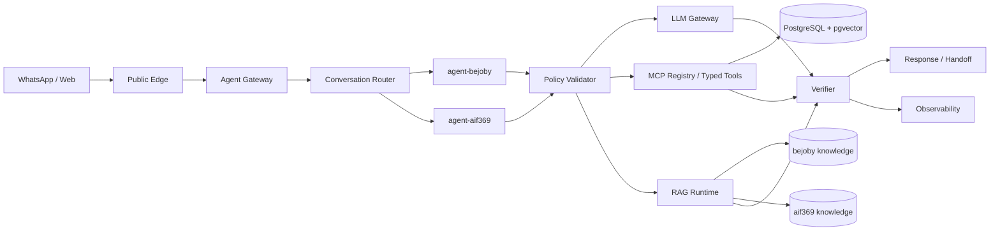

# AIF369 / BeJoby Agent Fabric Architecture

**Status:** active alignment document
**Date:** 2026-09-25

---

## Ownership Model

### AIF369

Owns shared Agent Fabric infrastructure:
- `agent-gateway`
- `policy-validator`
- `llm-gateway`
- `mcp-registry`
- `rag-runtime`
- `postgres-pgvector`
- `observability`
- `agent01` infrastructure
- shared deployment scripts
- shared operator control plane

### BeJoby

Consumes shared AIF369 Agent Fabric and owns:
- `bejoby.com` web experience
- BeJoby domain agent
- candidate workflows
- employer workflows
- BeJoby-specific tools
- BeJoby-specific policies
- BeJoby-specific knowledge base

### AIF369 Web

Consumes and showcases the shared Agent Fabric and owns:
- `aif369.com` web experience
- AIF369 commercial agent
- AI Sprint leads
- governance leads
- consulting workflows
- AIF369-specific knowledge base

---

## Logical Path

```text
WhatsApp / Web
  -> Public Edge
  -> Agent Gateway / Conversation Router
  -> Specialized Agent / Skill
  -> LLM Gateway
  -> MCP / Typed Tools
  -> PostgreSQL + pgvector
  -> RAG
  -> Observability
```

---

## Runtime Decision

`agent01` runs one shared agentic team behind a common `agent-gateway`, not separate duplicated BeJoby and AIF369 stacks.

Initial specialist agents:
- `agent-bejoby`
- `agent-aif369`

Shared services:
- `policy-validator`
- `llm-gateway`
- `mcp-registry`
- `rag-runtime`
- `postgres-pgvector`
- `observability`

---

## Routing Strategy

Routing order:
1. Explicit channel or tenant.
2. Persisted conversation context.
3. Deterministic domain rules.
4. Intent classification.
5. Clarification when ambiguous.

Do not rely blindly on an LLM to choose the agent.

---

## Execution Loop

```text
receive
  -> resolve tenant
  -> classify intent
  -> select specialist agent
  -> plan
  -> policy pre-check
  -> execute tool / RAG / LLM
  -> observe result
  -> validate
  -> respond / retry / fallback / handoff
```

Critical best practices must be enforced by code, schemas and policies, not prompt instructions alone.

---

## Tenant Separation

Shared:
- Agent Gateway
- LLM Gateway
- MCP registry
- Observability
- Infrastructure
- Docker host provisioning

Separated by tenant:
- data
- policies
- prompts
- typed tools
- skills
- knowledge roots

Knowledge roots:

```text
/data/knowledge/bejoby/
/data/knowledge/aif369/
```

Never mix private or tenant-specific knowledge bases.

---

## Mermaid


