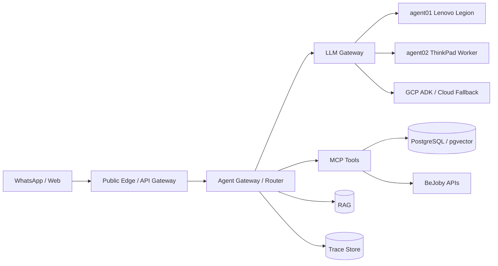
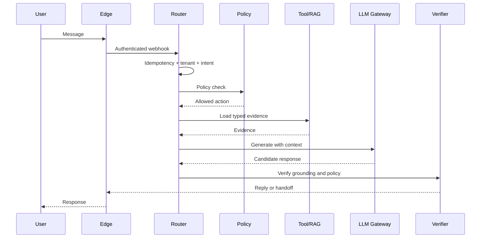
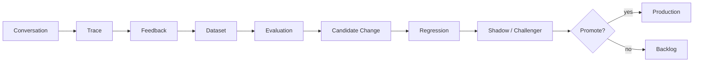

# SPEC 00 - AIF369 / BeJoby Agent Fabric

**Estado:** Draft SDD
**Version:** 0.2
**Fecha:** 2026-09-24
**Objetivo:** plataforma local-first con continuidad cloud, trazabilidad completa y evolucion por performance medido.

---

## 1. Principios

- Siempre debe existir una ruta de respuesta al cliente.
- Empezar pequeno: texto + tools + BD; multimedia y componentes pesados despues.
- `agent01` Lenovo Legion es el nodo productivo principal.
- `agent02` ThinkPad es worker/challenger y nunca dependencia del flujo basico.
- Ningun LLM usa SQL libre contra produccion: solo tools tipadas.
- Un LLM Gateway desacopla agentes de modelos y permite fallback local/cloud.
- Cada decision relevante genera metadata auditable.
- Feedback -> evaluacion/regresion -> promocion; nunca aprendizaje online directo.
- Una regla critica nunca depende solo de RAG ni de que el LLM la recuerde.

---

## 2. Topologia

```text
WhatsApp/Web
  -> Public Edge/API Gateway
  -> Agent Gateway/Router
  -> LLM Gateway
       |-> agent01 local
       |-> agent02 worker/challenger
       `-> GCP ADK/cloud fallback

MCP/Tools
  -> PostgreSQL/pgvector/RAG
  -> BeJoby APIs
  -> Firestore/GCS where applicable
```

### agent01 - Lenovo Legion

Rol:
- Gateway/router/runtime.
- PostgreSQL + pgvector.
- RAG.
- MCP y tools criticas.
- Modelo local Mistral/Hermes u otro <=7B solo si benchmarks de RAM/VRAM/latencia lo permiten.

Regla critica:
- Debe responder aunque `agent02` este caido.

### agent02 - Lenovo ThinkPad

Rol:
- Worker liviano para jobs asincronos.
- ETL.
- Procesamiento documental.
- Embeddings pequenos.
- Evaluaciones y regression/shadow tests.
- Backups.
- Monitoring.
- Tools de bajo consumo.

Regla critica:
- No aloja dependencias indispensables del camino sincrono.

### Cloud Fallback

GCP ADK/Agent Runtime puede operar como continuidad para flujos pequenos y controlados.

Reglas:
- Reutilizar contratos MCP/tools cuando sea viable.
- Minimizar PII enviada a cloud.
- Registrar razon de fallback y costo.

---

## 3. Camino Critico

```text
Webhook
  -> auth/idempotency
  -> tenant/intent
  -> policy
  -> tool/RAG
  -> LLM Gateway
  -> verifier
  -> WhatsApp/web reply
```

Fuera del camino critico:
- Audio/video.
- Reindexados.
- Evaluaciones.
- Challenger runs.
- Backups.
- ETL analitico.

---

## 4. LLM Gateway

Interfaz:

```text
generate(request)
embed(request)
health()
capabilities()
```

Routing:
1. Modelo local saludable y apto.
2. Segundo nodo/modelo local si corresponde.
3. Cloud/ADK permitido.
4. Respuesta degradada deterministica o handoff.

Metadata requerida:
- Provider/model/version.
- Nodo.
- Latencia.
- Tokens.
- Razon de routing/fallback.
- Timeout/error.
- Costo.

---

## 5. Ubicacion De Reglas

### Codigo / Config Versionada

- Autorizacion.
- Aislamiento tenant.
- Limites.
- Timeouts.
- Schemas.
- Prohibiciones.
- Seguridad.
- Idempotencia.

### PostgreSQL + Cache

- Catalogo.
- Horarios.
- Precios.
- Estados.
- Reglas comerciales por tenant.
- Feature flags.
- Snapshots versionados para evitar consultas repetidas.

### RAG

- Documentos.
- FAQs.
- Manuales.
- Politicas explicativas.

---

## 6. Trazabilidad

Cada `agent_run` registra:

```json
{
  "trace_id": "...",
  "conversation_id": "...",
  "tenant_id": "...",
  "agent": "...",
  "agent_version": "...",
  "skill": "...",
  "skill_version": "...",
  "intent": "...",
  "policy_version": "...",
  "prompt_version": "...",
  "model_provider": "...",
  "model": "...",
  "model_version": "...",
  "route_reason": "...",
  "retrieval_refs": [],
  "tool_calls": [],
  "decision_summary": "...",
  "confidence": null,
  "verification": {},
  "fallbacks": [],
  "latency_ms": 0,
  "token_usage": {},
  "stop_reason": "...",
  "user_feedback": null
}
```

`decision_summary` es explicacion operacional breve. No se almacena razonamiento interno del modelo.

---

## 7. Frameworks

- **LangGraph:** candidato para workflows stateful, retries, checkpoints, tool routing y handoff, detras de interfaces propias.
- **LangChain:** uso selectivo para loaders, retrievers e integraciones.
- **LangSmith:** util para desarrollo/evaluacion si adoptamos LangGraph/LangChain; no obligatorio en produccion.
- **Langfuse + OpenTelemetry:** opcion preferida inicial para traces, generations, tool calls, latencia/tokens/costo, scores y experimentos. Redactar PII antes de exportar.

---

## 8. MCP / Tools

Tools tipadas, minimo privilegio, auditables e idempotentes para escritura.

Ejemplos:
- `application.get_status`
- `jobs.search`
- `candidate.get`
- `services.list`
- `lead.create`
- `appointment.request`
- `document.search`
- `handoff.create`

Reglas:
- No SQL libre desde LLM.
- Inputs/outputs con schema.
- Tenant obligatorio.
- Escrituras idempotentes o con clave de idempotencia.
- Auditoria por tool call.

---

## 9. WhatsApp

Fases:
- P0: texto + links HTTPS/email/telefono/WhatsApp validados y generados por backend.
- P1: imagenes.
- P2: audio -> transcripcion.
- P3: video asincrono.

Regla:
- El LLM no inventa URLs. Produce acciones estructuradas que valida/renderiza el backend.

---

## 10. Loop Engineering

```text
conversation
  -> trace
  -> feedback
  -> dataset
  -> evaluation
  -> cambio candidato
  -> regression
  -> shadow/challenger
  -> promocion
```

Orden de mejora:
1. RAG.
2. Reglas.
3. Skills.
4. Prompts.
5. Tools.
6. Fine-tuning/LoRA solo con dataset curado, anonimizado y evaluado.

`agent02` puede ser challenger/evaluator asincrono.

---

## 11. Datos: Databricks + dbt

Databricks queda fuera del camino sincrono de WhatsApp.

### Bronze

- `messages`
- `agent_runs`
- `tool_calls`
- `retrieval_events`
- `feedback`
- `model_usage`
- `system_health`

Crudos, append-only.

### Silver

- Conversaciones normalizadas.
- Decisiones.
- Tools.
- Outcomes.
- Feedback clasificado.
- Latencias.
- Errores.
- Costos.

### Gold

- Resolucion.
- p50/p95/p99.
- Fallback rate.
- Tool failure rate.
- Grounded-answer rate.
- Handoff rate.
- Satisfaccion.
- Costo y calidad por version.

dbt versiona transformaciones SQL, tests, documentacion y modularidad. dbt transforma datos ya cargados, no reemplaza la ingestion.

---

## 12. Roadmap

- F0: `agent01` + texto + PostgreSQL + tool read-only + health.
- F1: LLM Gateway + local <=7B + cloud fallback.
- F2: `agent02` para background/evaluacion.
- F3: LangGraph + MCP ampliado + multimedia.
- F4: telemetria -> Bronze/Silver/Gold + dbt + Databricks.
- F5: Loop Engineering con datasets/evaluaciones/challenger.

---

## 13. Definition Of Done P0

- Ubuntu estable.
- `/health` y `/ready`.
- PostgreSQL/pgvector.
- Webhook WhatsApp.
- Router tenant/intent.
- Una tool real read-only.
- LLM Gateway con health/routing.
- `trace_id` end-to-end.
- Metadata de decisiones.
- Links estructurados.
- Backup.
- Limites de recursos.
- Prueba de caida del LLM local con fallback controlado.

---

## 14. Diagramas Mermaid

### 14.1 Arquitectura



### 14.2 Camino Critico



### 14.3 Loop Engineering


