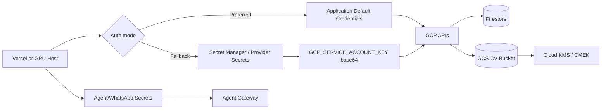

# BeJoby - Secrets, Credentials and KMS Specification

**Estado:** Aprobado para implementacion incremental
**Version:** 0.1
**Fecha:** 2026-09-24
**Metodologia:** Spec Driven Development (SDD)

---

## 1. Objetivo

Definir como BeJoby debe manejar credenciales, tokens, service accounts y llaves de cifrado sin exponer secretos en codigo, frontend, logs ni documentos.

---

## 2. Principios

- No commitear secretos.
- No exponer secretos al frontend.
- Preferir identidad del runtime sobre JSON keys.
- Usar Secret Manager o secretos del proveedor de deploy para valores sensibles.
- Usar Cloud KMS/CMEK para cifrado de datos sensibles cuando aplique.
- Rotar credenciales ante exposicion o sospecha.
- Dar permisos minimos por servicio.

---

## 3. Credenciales GCP

### Produccion En GCP

Preferido:
- Service account asociado al runtime.
- Application Default Credentials / Workload Identity.
- Sin `GCP_SERVICE_ACCOUNT_KEY` JSON.

Variables:

```text
GCP_PROJECT_ID
FIRESTORE_DATABASE_ID
GCS_CV_BUCKET
GCS_CV_KMS_KEY_NAME
```

### Produccion En Vercel

Si el runtime no puede usar identidad GCP nativa:
- Guardar `GCP_SERVICE_ACCOUNT_KEY` como secreto de Vercel.
- Preferir Base64 del JSON completo para evitar errores de comillas/saltos de linea.
- Nunca poner el JSON como texto multilina en el repo.

Formato recomendado:

```text
GCP_SERVICE_ACCOUNT_KEY=<base64-del-json-completo>
```

### Desarrollo Local

Opciones permitidas:

1. ADC local:

```bash
gcloud auth application-default login
```

2. Archivo local fuera del repo:

```bash
export GOOGLE_APPLICATION_CREDENTIALS="$HOME/.config/bejoby/service-account.json"
```

3. `.env.local` con Base64 temporal:

```text
GCP_SERVICE_ACCOUNT_KEY=<base64-del-json-completo>
```

No usar JSON raw entre comillas en `.env.local`; es fragil y puede romper el parser por comillas internas o saltos de linea.

---

## 4. Cloud KMS / CMEK

CVs en GCS:
- Bucket privado.
- Public Access Prevention.
- Uniform bucket-level access.
- Cifrado Google-managed por defecto.
- CMEK opcional con `GCS_CV_KMS_KEY_NAME`.

Variable:

```text
GCS_CV_KMS_KEY_NAME=projects/{project}/locations/{location}/keyRings/{ring}/cryptoKeys/{key}
```

Reglas:
- La service account del backend debe tener permiso de uso de la key.
- La key debe tener rotacion configurada.
- El acceso a KMS debe auditarse.

---

## 5. Secretos Del Agente Conversacional

Variables sensibles:

```text
AGENT_SERVICE_TOKEN
META_WHATSAPP_TOKEN
META_WHATSAPP_VERIFY_TOKEN
MCP_INTERNAL_TOKEN
LLM_GATEWAY_TOKEN
```

Reglas:
- Solo backend/gateway puede leerlas.
- Nunca deben llegar al frontend.
- No deben aparecer en logs.
- Rotacion inmediata si se comparten por error.

---

## 6. Permisos Minimos

Service account backend:
- Firestore read/write solo colecciones necesarias.
- GCS object admin limitado al bucket de CVs.
- KMS cryptoKey encrypter/decrypter solo si se usa CMEK.
- Secret accessor solo a secretos necesarios.

Service account agente:
- Acceso solo a tools/API internas necesarias.
- Sin acceso directo a SQL/Firestore completo.
- Sin permiso de leer CV raw salvo skill autorizada y auditada.

---

## 7. Diagrama Mermaid



---

## 8. Operacion Local Recomendada

Para corregir errores tipo:

```text
GCP_SERVICE_ACCOUNT_KEY is not valid JSON or Base64-encoded JSON
```

usar una de estas rutas:
- Quitar `GCP_SERVICE_ACCOUNT_KEY` local y usar ADC.
- Reemplazar `GCP_SERVICE_ACCOUNT_KEY` por Base64 del JSON completo.
- Verificar que `.env.local` no tenga JSON raw con comillas internas sin escapar.

No pegar credenciales en chats, tickets ni documentacion.
